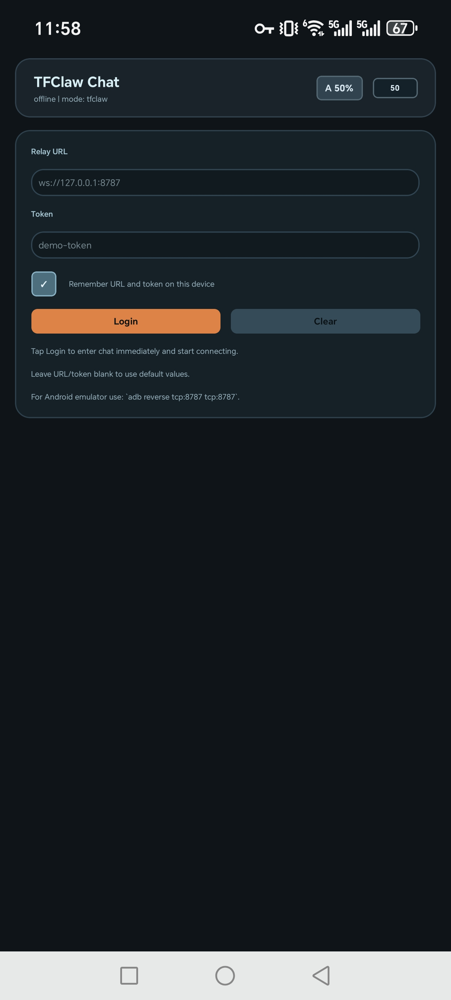
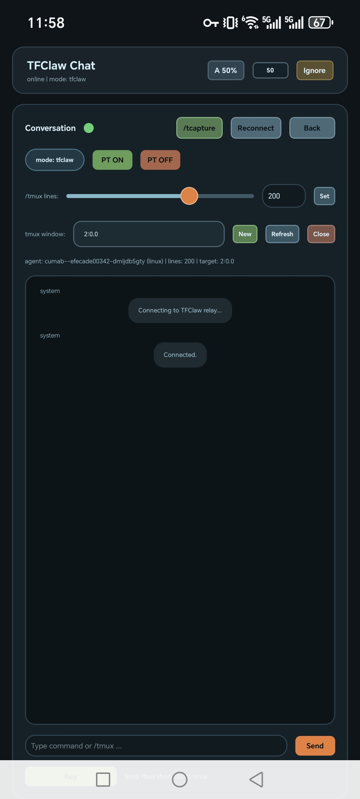

# Token-Free-Claw (TFClaw)
 
* OpenClaw本体需要API Key太贵。
* 使用Oauth？Claude又拒绝Oauth给第三方软件。
* 官方Claude Code App版本只面向Max订阅用户开放。

TFClaw 是一个“面向 terminal 的远程桌面”MVP，并提供对应的app服务，帮助用户在手机端随时启动命令行完成代码任务。

* 本体不提供Agent服务无须token，在terminal中启动自己的agent直接对话，复用成熟cli的上下文管理。
* Claude Code不让你用Claw，直接远程terminal启动官方Claude code，你能奈我何？
* 开源app（暂时只有安卓）连接远程terminal实现任何人可以手机上使用的Claude code app。

## 组成部件
1. `server` 只做转发与状态缓存（按 token 组织会话）。
2. `terminal-agent` 运行在用户电脑/服务器上，管理多个 terminal 并上报输出。使用tmux控制。
3. `gateway`（位于 `apps/feishu-gateway`，目前只支持飞书）统一管理 Chat Apps，并将消息映射为 terminal 指令。
4. `mobile`（Android 优先）查看 terminal 列表、输出，并发送命令（含 Ctrl+D 等控制键）。


## 当前已实现能力

- 通过 `token` 关联移动端/飞书端与 terminal-agent。
- agent 支持：
  - 新建 terminal
  - 关闭 terminal
  - 写入输入（支持 `__CTRL_C__`、`__CTRL_D__`、`__ENTER__`）
  - 实时回传 stdout/stderr
  - 可截图源列表（屏幕 + Windows 窗口）
  - 按 `sourceId` 选择截图（屏幕或窗口，返回 base64 图片）
- server 支持：
  - agent/client 角色鉴权（query token）
  - terminal 状态与输出快照缓存
  - 命令转发与基础 ACK
- gateway（Feishu 通道）支持：
    - `/tmux help查看所有支持命令`
    - `/tmux status|sessions|panes|new|target|close|socket|lines|wait|stream|capture|key|send`
    - `/t<subcommand>` 别名（例如 `/tkey` `/ttarget` `/tcapture`）
    - `/passthrough on|off|status` 与 `/pt on|off|status`
  - passthrough 开启后，普通消息持续直通 tmux（直到 `/pt off`）
  - `/capture` 返回“屏幕/窗口编号列表”，回复数字后回传对应图片
  - tmux 流式输出会实时回推 progress，并在飞书端新消息发出后自动撤回上一条 progress（防堆叠）
  - 收到用户消息后会先给原消息添加 reaction（默认 `OnIt`）
- mobile（Expo）支持以下以及和gateway相同的/tmux, /passthrough命令：
  - 连接 relay
  - 查看 terminal 列表并切换
  - 查看输出、输入命令、快捷键
  - 新建/关闭 terminal
  - 触发截图并显示最新图片（仅限windows端。）


### /tmux 与 /passthrough 命令说明

以下命令在飞书端、mobile 端、terminal 本地测试链路中保持一致：

```text
/tmux help
/tmux status
/tmux sessions
/tmux panes [session]
/tmux new [session]
/tmux target <session:window.pane|id>
/tmux close <id|session:window.pane>
/tmux socket <path|default>
/tmux lines <20-5000>
/tmux wait <0-5000>
/tmux stream <auto|on|off>
/tmux capture [lines]
/tmux key <key...>
/tmux send <literal command>
/passthrough on|off|status
/pt on|off|status
/t<subcommand> 作为 /tmux 子命令别名（例如 /tkey /ttarget /tcapture）
```

说明：
1. `/tmux help`
   显示 tmux 控制命令总览（相当于命令菜单），用于快速查看当前支持的子命令和语法。

2. `/tmux status`
   查看当前会话的 tmux 控制状态，包括：`passthrough` 开关、当前 `target`、`socket`、`capture_lines`、`wait_ms`、`stream_mode`。

3. `/tmux sessions`
   列出当前 tmux server 下可见的 session 列表（等价于 tmux 会话级概览）。

4. `/tmux panes [session]`
   列出 pane 清单；会返回可用于后续操作的编号 id（`[1] [2] ...`）。  
   可选参数 `[session]` 用于只看某个 session；不传则列出可见 pane。  
   返回结果中每个 pane 包含 `target/window/cmd/activity` 信息。

5. `/tmux new [session]`
   新建 tmux session（默认名 `tfclaw`），并把当前 target 自动切到 `${session}:0.0`。  
   传 `[session]` 时按给定名称创建。

6. `/tmux target <session:window.pane|id>`
   切换当前操作目标 pane。  
   参数既可用完整 target（如 `tfclaw:0.0`），也可用 `/tmux panes` 返回的编号 id。  
   切换后会返回该 target 的最新 capture 内容。

7. `/tmux close <id|session:window.pane>`
   关闭指定 pane/window（支持编号 id 或完整 target）。  
   若当前 target 正好属于被关闭窗口，会自动清空当前 target 并提示。

8. `/tmux socket <path|default>`
   设置或切换 tmux socket。  
   传 `default` 恢复默认 socket；传具体 `path` 使用指定 socket。  
   不带参数时返回当前 socket。

9. `/tmux lines <20-5000>`
   设置 capture 行数上限（用于后续 capture/send/key 返回内容长度）。  
   值会被限制在 `20-5000`。不带参数时返回当前行数。

10. `/tmux wait <0-5000>`
    设置发送命令后抓取输出前的等待时间（毫秒）。  
    值会被限制在 `0-5000`。不带参数时返回当前 wait 值。

11. `/tmux stream <auto|on|off>`
    设置流式输出策略：  
    `auto`：对常见长任务命令自动启用流式；  
    `on`：强制流式；  
    `off`：关闭流式。  
    不带参数时返回当前 stream 模式。

12. `/tmux capture [lines]`
    直接抓取当前 target 的屏幕内容并返回。  
    可选 `[lines]` 可临时覆盖本次抓取行数（同样会被限制到 `20-5000`）。

13. `/tmux key <key...>`
    向当前 target 发送按键序列（不直接发送文字命令），例如 `Enter`、`Esc`、`Ctrl+C`、`^C`。  
    支持多 token 组合，常用于中断、确认、方向键等控制动作。

14. `/tmux send <literal command>`
    将后续文本按“字面命令”发送到当前 target 并回车执行，再按当前 `wait/lines/stream` 规则回传输出。  
    适合明确要求“原样发送”的场景。

`/passthrough` 模式行为(支持简写为`/pt`)：

- `/passthrough on`（或 `/pt on`）后，后续普通消息会持续直通当前 tmux target，直到 `/passthrough off`。
- 若开启时尚未设置 target，会自动使用 `tfclaw:0.0`。
- passthrough 开启时，`/tmux ...`、`/passthrough ...`、`/pt ...` 这些控制命令仍在本地解析，不会直通 tmux。
- 如需强制把“看起来像本地控制命令”的 slash 文本发给 tmux，可在前面加一个 `/`，即使用 `//` 前缀（例如 `//tmux list-sessions`）。

手机app端已实现上述大部分命令的直接按钮。

## 目录结构

```text
apps/
  server/
  terminal-agent/
  mobile/
  feishu-gateway/
packages/
  protocol/
```

## 本地启动

先进入根目录。

### 1. 安装依赖

```bash
npm install
```

### 2. 编译检查

```bash
npm run build
```

### 3.1 飞书服务启动 


1. 在飞书开放平台创建应用并启用 Bot。
2. 权限添加 `im:message`，
3. 可选权限添加消息撤回权限，用于模拟terminal端的node动态输出。
4. 从 `config.example.json` 复制一份到 `config.json` 并填入 token/app 凭证。
5. 一键启动整套（（build） + server + agent + feishu-gateway）：

默认监听：`ws://0.0.0.0:8787`，

```bash
npm run start:stack
```

开发模式一键启动：

```bash
npm run dev:stack
```
说明：`gateway` 会优先读取 `config.json`，若不存在则回退到旧环境变量模式（兼容历史脚本）。

6. 打开飞书开放平台的机器人下的事件订阅选择 **长连接（Long Connection）**。
7. 事件添加 `im.message.receive_v1`。
8. 给飞书机器人发消息。


### 3.1. 手机app服务启动
具体查看[dockerdeployReadMe.md](https://github.com/yxzwang/TFClaw/blob/main/dockerdeployReadMe.md)

1. 一键在docker中启动
```bash
./scripts/deploy-docker-public.sh start
```
会打印log中包含
TFCLAW_TOKEN=xxxxxxxxx
TFCLAW_RELAY_URL=wss://xxxxxxxxxx.com
用这两个在手机app上login，显示connect就成功了。

登录界面如下，最上面的A 50%可以点击切换比例，右边可以手动输入比例。



登陆后连接状态指示灯变绿，点击最上面ignore可以将terminal显示全屏：



2. 查看状态
```bash
./scripts/deploy-docker-public.sh status
```
3. 关闭服务
```bash
./scripts/deploy-docker-public.sh stop
```

注意服务第一次启动的token会随机生成，后续每次启动（重启）会复用原token，url会重新生成。


## Android APK 构建

见 `apps/mobile/README.md`，使用 EAS 进行 `preview` APK 构建。release已发布上述演示版本，不放心可以自己编译。

## 环境变量

- `apps/server/.env.example`
- `apps/terminal-agent/.env.example`
- `apps/mobile/.env.example`
- `apps/feishu-gateway/.env.example`
- `config.example.json`

gateway 额外支持：`TFCLAW_CONFIG_PATH=/path/to/config.json`

常用新增参数：

- gateway
  - `TFCLAW_COMMAND_RESULT_TIMEOUT_MS`（默认 `86400000`，24h）
  - `TFCLAW_PROGRESS_RECALL_DELAY_MS`（默认 `350`ms）
  - `TFCLAW_FEISHU_ACK_REACTION_ENABLED`（默认 `1`）
  - `TFCLAW_FEISHU_ACK_REACTION`（默认 `OnIt`）
- terminal-agent
  - `TFCLAW_TMUX_SUBMIT_DELAY_MS`（默认 `60`）
  - `TFCLAW_TMUX_STREAM_POLL_MS`（默认 `350`）
  - `TFCLAW_TMUX_STREAM_IDLE_MS`（默认 `3000`）
  - `TFCLAW_TMUX_STREAM_INITIAL_SILENCE_MS`（默认 `12000`）
  - `TFCLAW_TMUX_STREAM_WINDOW_MS`（默认 `86400000`，24h）

## 公网部署与安全

推荐架构：公网仅开放 `443`，由反向代理（Nginx/Caddy/Traefik/Cloudflare Tunnel）接入，再反代到本机 `server`（如 `127.0.0.1:8787`）。

最低安全基线：

1. 启用 TLS（仅 `wss://`），不要直接裸露 `ws://` 到公网。
2. 使用强 token（建议 32+ 随机字符）并定期轮换。
3. 在 `apps/server` 启用以下限制：
   - `RELAY_ENFORCE_STRONG_TOKEN=true`
   - `RELAY_ALLOWED_TOKENS=<comma-separated tokens>`
   - `RELAY_ALLOWED_ORIGINS=<comma-separated origins>`（仅浏览器端需要）
   - 连接/消息限流相关参数见 `apps/server/.env.example`
4. 防火墙限制：只允许反向代理访问 relay 端口，不允许公网直连 relay。
5. 运行在进程管理器下（systemd/pm2/docker restart policy）并开启日志监控与告警。

## 已知限制（MVP）
- 目前飞书端动态窗口的跟踪还是没有做到预设的24h，原因未知。可以手动/tcapture查看目前运行情况。
- 窗口枚举/窗口截图当前仅在 Windows agent 上实现；Linux/macOS 暂仅屏幕截图。
- 未实现用户注册；身份依赖共享 token。
- 使用手机app需要server连接公网，注意安全。

